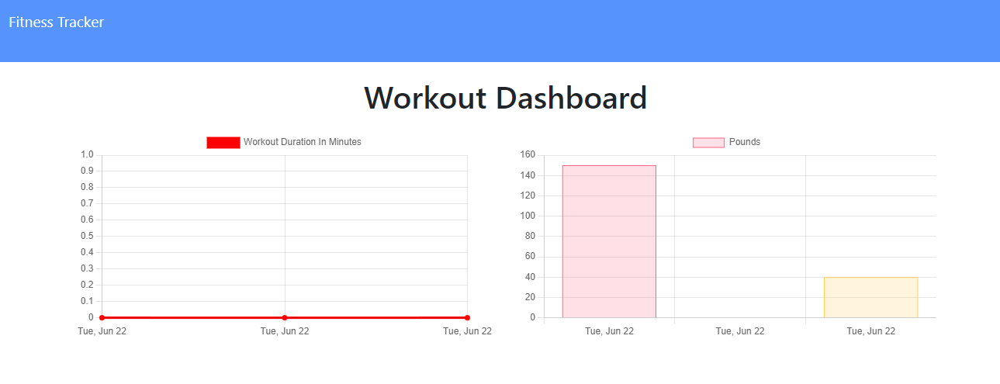

# Workout Tracker

 [](https://opensource.org/licenses/MIT)

## Description
[Deployed Application](https://workout-tracker10.herokuapp.com/)

This is a workout tracker application, complete with a Mongo database with a Mongoose schema, and the routes are handled with Express. This allows the user to view, create, and track daily workouts.


## Table of Contents 
* [Description](#description)
* [Installation](#installation)
* [Usage](#usage)
* [Screenshots](#screenshots)
* [License](#license)
* [Badge](#badge)
* [Questions](#questions)

## Installation
To install this program, use the following command:
```
npm i
```

## Usage

To run this program, use the following command:  
```
npm start
```  


## Screenshots





## License

MIT
https://opensource.org/licenses/MIT


## Badge

[](https://github.com/ellerbrock/open-source-badges/)


## Questions

* If you have any questions or concerns, please contact me at https://github.com/ricapi96, or email me at enroquemore@gmail.com.
